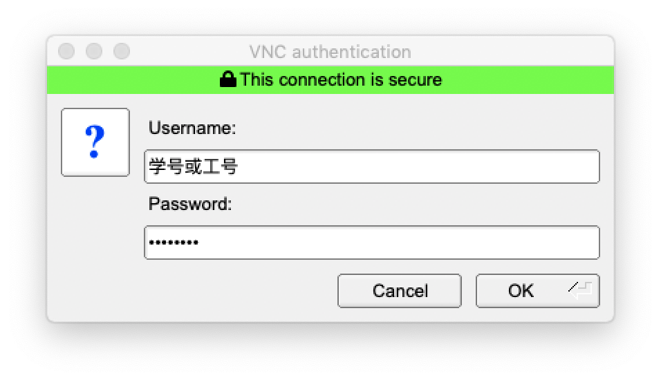

# Linux 系统登录虚拟机

## 使用 SSH 登录 {#ssh}

打开终端，安装 SSH 客户端：

* Ubuntu 和 Debian：`sudo apt-get install ssh`
* CentOS, Fedora 和 RHEL：`sudo yum install ssh-clients`
* Arch Linux 和 Manjaro：`sudo pacman -S openssh`

* 从 Vlab SSH 统一认证方式登录：

    ```shell
    ssh root@vlab.ustc.edu.cn
    ```

* 如果遇到 Warning，请输入 `yes`，然后根据提示，即可登录虚拟机

    

<!-- TODO: TBD: 增加一个 bullet point，说明如何选择虚拟机内的用户名 (root/ubuntu/vlab) -->\

!!! info "提示"

    想要以虚拟机内的用户名登录只需要修改登录命令，如换成 ubuntu 用户：

    ```shell
    ssh ubuntu@vlab.ustc.edu.cn
    ```

<!-- TODO: TBD: 增加一个 bullet point，说明如何使用公钥登录 -->


## 使用 VNC 登录 {#vnc}

!!! info "注意"

    该登录方式只适用于名称中带有 `desktop` 的虚拟机镜像。

可以使用 RealVNC 或 TigerVNC 登录：

### 使用 TigerVNC 登录（推荐） {#tigervnc}

安装 TigerVNC 客户端：

* Ubuntu 和 Debian：`sudo apt install tigervnc-viewer`

* CentOS, Fedora 和 RHEL：`sudo yum install tigervnc`

* Arch Linux 和 Manjaro：`sudo pacman -S tigervnc`

打开 TigerVNC 客户端，如图所示输入 `vlab.ustc.edu.cn`，点击 `Connect`。


这里提示要输入用户名和密码，输入学号（或工号）和网页平台的登录密码即可登录：



!!! question "拥有多个虚拟机？"

    如果你拥有多个虚拟机，使用 VNC 登录时请输入 `学号:虚拟机编号` 的形式，例如 `PB17000000:1234`。

!!! question "密码是什么？"

    VNC 登录方式使用 Vlab 平台的登录密码。[还没设置？](../web.md#change-password)

### 使用 RealVNC 登录 {#realvnc}

在 [RealVNC 官网的下载页面](https://www.realvnc.com/en/connect/download/viewer/linux/) 下载适合你的系统的安装包

* Ubuntu 和 Debian：选择 DEB x64，下载后安装：`sudo apt install ./文件名`

* CentOS, Fedora 和 RHEL：选择 RPM x64，下载后安装：`sudo yum localinstall 文件名`

* 其他系统：选择 Standalone x64，加上执行权限 (`chmod a+x`) 后直接运行

后续操作与 Windows 和 macOS 下使用 RealVNC 连接相同，可以在 [这里](macos.md#vnc) 继续阅读。
