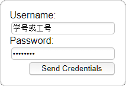

# 使用浏览器登录虚拟机

!!! info "注意"

    该登录方式只适用于名称中带有 `desktop` 的虚拟机镜像。

???+ info "浏览器支持"

    此登录方式需要浏览器支持。以下浏览器是受支持的：

    - Google Chrome 49 或以上
    - Mozilla Firefox 44 或以上
    - Safari 11 或以上
    - Opera 36 或以上
    - Internet Explorer 11
    - Microsoft Edge 12 或以上

    我们推荐最新版本的 [Google Chrome](https://www.google.cn/chrome/) 和 [Mozilla Firefox](https://www.mozilla.org/zh-CN/firefox/new/)，它们能提供最完整的功能和最好的使用体验。

浏览器登录非常简单，只需要打开 [在线登录页面](https://vlab.ustc.edu.cn/vm-vnc)，输入学号（工号）和虚拟机管理页面的登录密码，确认即可：

{: .img-center }

!!! question "密码是什么？"

    VNC 登录方式使用 Vlab 平台的登录密码。[还没设置？](../#change-password)

## 设置中文输入法 {#chinese-ime}

系统自带的输入法为 IBus，可以手动启用中文输入。在左上角找到 Applications → Settings → IBus Preferences 设置：

{: .img-center }

在 Input Method 选项卡点 Add，然后在 Chinese 里找到 Pinyin，再次点击右下角的 Add 即可：

{: .img-center }

添加成功后可以在右上角切换中文与英文输入法，也可以按 <kbd>Shift</kbd> 键在中文输入法中切换中英文输入。

## 使用组合键 {#combo-keys}

!!! tip "客户端更方便"

    使用 RealVNC 客户端能够更方便地使用虚拟机的完整功能，因此如果你经常在虚拟机上进行复杂操作的话，我们建议你使用 RealVNC 客户端。不同平台的使用教程可以在左侧目录中查找。

在浏览器中使用组合键会受到一定限制，例如你的浏览器很可能会将 <kbd>Ctrl</kbd>+<kbd>W</kbd> 理解为“关闭当前标签”，或将 <kbd>Ctrl</kbd>+<kbd>T</kbd> 理解为“打开一个新标签”。为了能将这些组合键正确发送至虚拟机，你可以使用侧边栏提供的组合键功能，如图：

{: .img-center }

从上到下的 6 个按键分别为 ==Ctrl==, ==Alt==, ==Super==, ==Tab==, ==Esc== 和 ==Ctrl+Alt+Del== 组合键。点击它们中的一个或多个，再按键盘上的字母数字键，即可向虚拟机发送组合键。

## 使用剪贴板 {#clipboard}

<!--使用剪贴板时请确保虚拟机中的 VNC config 对话框是开启状态。-->

在虚拟机中复制文字后，点击展开左侧工具栏的第二个按钮即可查看虚拟机剪贴板中的内容。

{: .img-center .img-border }

如果想从主机中复制文字进虚拟机，可以将文字粘贴进左侧工具栏弹出的文本框中，即可在虚拟机中粘贴。

由于技术限制，从浏览器复制进虚拟机的中文会变成乱码，从虚拟机复制出来的文字不受影响。

## 左侧工具栏说明 {#novnc-toolbar}

左侧工具栏一共有 5 个按钮，如图：

{: .img-center }

从上往下功能依次为：

- [组合键](#combo-keys)
- [剪贴板](#clipboard)
- 全屏显示
- 设置
- 断开连接

## 桌面设置

关于一些常用的桌面设置，如

- 修改 VNC 分辨率
- 中文输入法

等，请参阅[桌面设置](../desktop-settings)页面。
