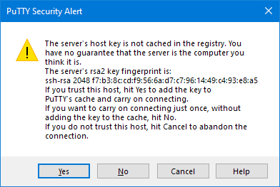
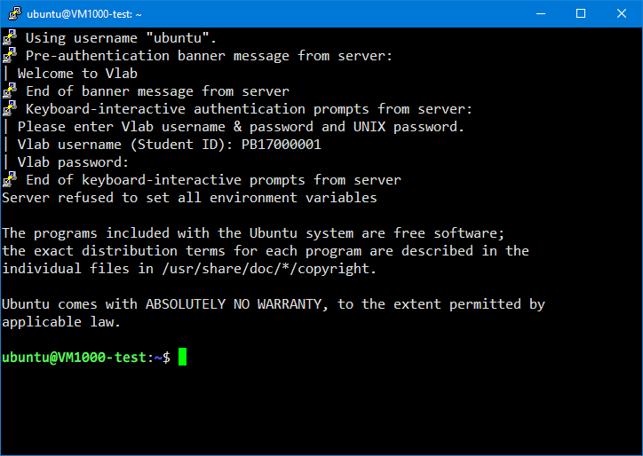
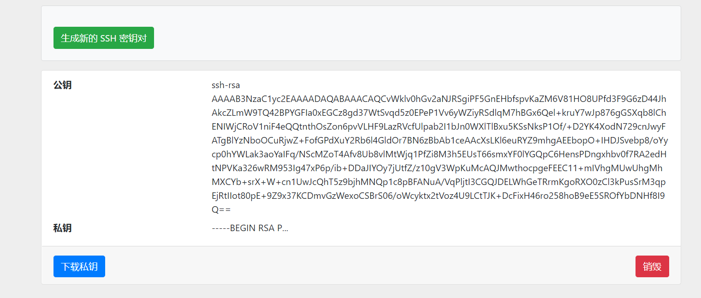
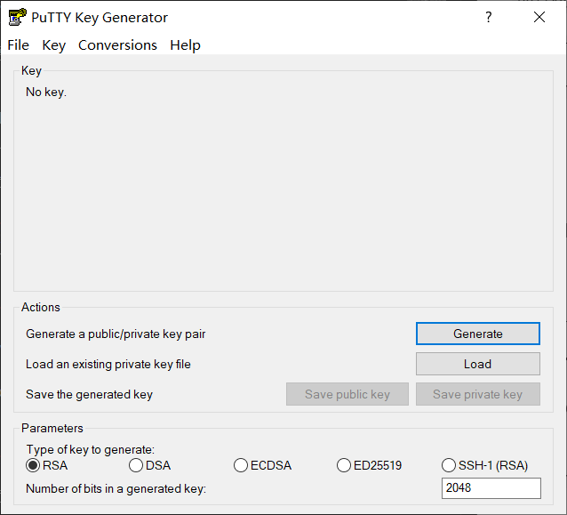
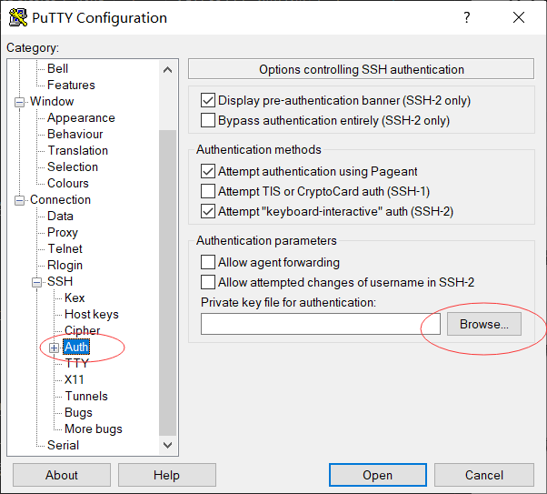

# Windows 系统登录虚拟机

## 命令行：使用 SSH 登录 {#ssh}

Windows 需要安装 SSH 客户端，有各种选择：

- PuTTY ([官方下载](https://www.chiark.greenend.org.uk/~sgtatham/putty/latest.html))
- XShell ([官方下载](https://www.netsarang.com/zh/free-for-home-school/))
- Termius ([官方下载](https://termius.com/windows)，另有 [Windows 10 应用商店版](https://www.microsoft.com/store/productId/9NK1GDVPX09V))

另外，Windows 平台有各种 Linux / Unix 环境模拟软件，例如

- Git Bash (MSYS2)
- Cygwin
- Windows Subsystem for Linux

对于以上平台，请参考 [Linux 系统的登录方式](login-linux.md)

下面以免费开源的 PuTTY 为例在 Windows 上连接 Vlab 虚拟机。

### PuTTY 登录 {#putty}

安装过程很简单，直接 \[下一步\] 到底即可。安装完成后，找到并打开 PuTTY，如图

在 Host name 一栏填入 `vlab.ustc.edu.cn`，端口号填写 22（这是默认值），点击连接，如图：

第一次连接时会提示你选择信任 Vlab 统一登录平台，点 Yes 即可：

然后 PuTTY 会要求你输入用户名和密码，用户名输入 root 或 ubuntu 或 vlab（参见[镜像配置](images.md#image-content)），然后根据提示输入你的 Vlab 用户名和密码（输入的密码没有回显），按回车即可：

!!! question "用户名密码是什么？"

    `Vlab username` 是你的学号（或工号），在登录虚拟机管理页面后可以在右上角看到。

    `Vlab password` 是 Vlab 平台的登录密码，不是虚拟机的 root 密码。[还没设置？](web.md#change-password)

登录成功后即可使用虚拟机，如图：

PuTTY 还有一些高级的使用方法，例如你可以保存这些连接信息，以后可以更方便地连接虚拟机。这里有两篇不错的使用教程：

- <https://www.hostarr.com/putty-tutorial/>
- <https://www.cnblogs.com/yuwentao/archive/2013/01/06/2846953.html>

#### 使用公钥登录虚拟机 {#putty-pubkey}

使用公钥登录虚拟机可以免除每次输入密码的麻烦。

##### 生成 SSH 密钥对并下载到本地 {#pubkey-retrieve}

进入虚拟机管理界面，可以在自己虚拟机下方找到 SSH 密钥管理入口：

点击进入，即可通过点击 \[生成新的 SSH 密钥对\] 生成 SSH 密钥对：

此时公钥已经存储到自己的虚拟机上，只需要下载私钥并做一些配置就能利用密钥对进行免密登录。

点击 **下载私钥** 就能在下载文件中找到一个以 `.pem` 结尾的文件，这就是对应的 SSH 私钥。请妥善保管它，因为**任何获得这个文件的人都能够登录你的虚拟机**。

由于技术限制，每个虚拟机的私钥都是独立的。若你删除并重新创建了虚拟机，你需要重新生成密钥对才能使用密钥登录新的虚拟机。

##### 将 .pem 格式的私钥转换为 .ppk 格式 {#pubkey-convert}

由于 PuTTY 使用的私钥格式为其专用的 `.ppk` 格式，而不是更为通用的 PEM 格式，所以我们还要进行一步转换。

转换私钥格式需要用到 PuTTYgen，即 PuTTY 的密钥生成与转换工具。一般在安装 PuTTY 时已包含它，如果你安装的 PuTTY 中未包含这个工具，请在[这个页面](https://www.chiark.greenend.org.uk/~sgtatham/putty/latest.html)直接下载 `puttygen.exe`。

在开始菜单的 PuTTY 文件夹下，或者 PuTTY 的安装目录下就能找到 PuTTYgen，打开后可以看到如下界面：

点击 **Load** 找到刚刚下载的 `.pem` 文件打开，然后点击 **Save private key**，选择一个合适目录保存生成的 `.ppk` 文件。同样地，请妥善保管这个私钥文件。

##### 在 PuTTY 中设置私钥并保存会话信息 {#pubkey-save-session}

先到 Connection - Data 项设置自己的登录用户名（这里以 root 为例，你也可以使用 ubuntu 或 vlab，详情参见[镜像配置](images.md#image-content)），如图：

再点 SSH 项下面的 Auth，添加上一步转换得到的 `.ppk` 格式的私钥：

然后最重要的是回到最上面的 Session 项里保存，不然下次又得重新添加一遍。你可以为这个配置取一个容易辨别的名字，例如 `vlab`。

保存后每次登录时只需要双击之前保存的连接信息，就能免密登录你的虚拟机。

### XShell 方式 {#xshell}

TBD

<!--
Content:

- Where to download (hint: [下载页面](../downloads.md) )
- Follow the styles of the PuTTY section to complete this part

Similar to that of the PuTTY part, a section (start with H4) for pubkey login would be good.
-->

## 图形界面：使用 VNC 登录 {#vnc}

!!! info "注意"

    该登录方式只适用于名称中带有 `desktop` 的虚拟机镜像。

Vlab 平台目前支持 RealVNC 和 TigerVNC 两种客户端。

### 使用 RealVNC 登录

以 Windows 10 系统为例，[下载 RealVNC 客户端](https://www.realvnc.com/en/connect/download/viewer/windows/)并安装。安装好后在开始菜单中找到 RealVNC 的图标，如下图所示：

打开后的主界面如图所示，在地址栏输入 `vlab.ustc.edu.cn`，按回车连接：

这里提示要输入用户名和密码，输入学号（或工号）和网页平台的登录密码即可登录：

!!! question "密码是什么？"

    VNC 登录方式使用 Vlab 平台的登录密码。[还没设置？](web.md#change-password)

登录后即可看到桌面并开始使用。

### 使用 TigerVNC 登录 {#tigervnc}

以 Windows 10 系统为例，[下载 TigerVNC 客户端](https://vlab.ustc.edu.cn/downloads/vncviewer64-1.10.1.exe)，如图：

{: .img-border }

双击打开，在服务器地址处填入 `vlab.ustc.edu.cn`，如图：

这里提示要输入用户名和密码，输入学号（或工号）和网页平台的登录密码即可登录：

### 桌面设置 {#desktop-settings}

关于一些常用的桌面设置，如

- 修改 VNC 分辨率
- 中文输入法

等，请参阅[桌面设置](desktop-settings.md)页面。
