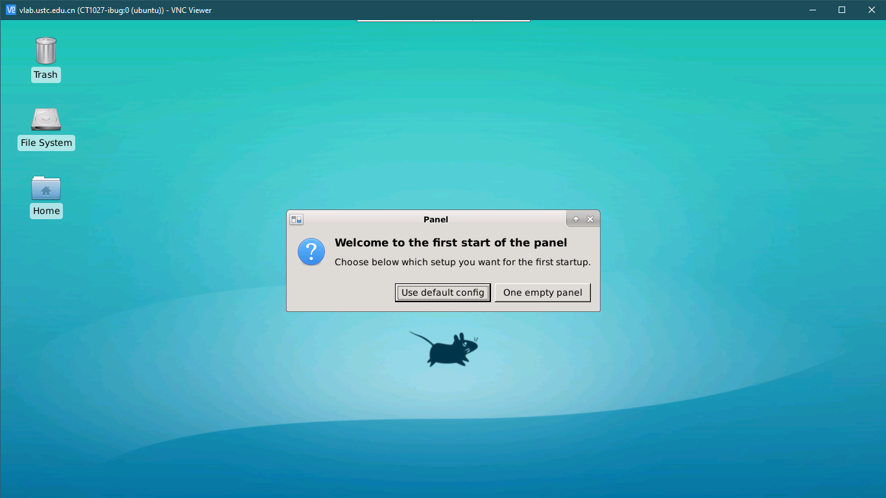
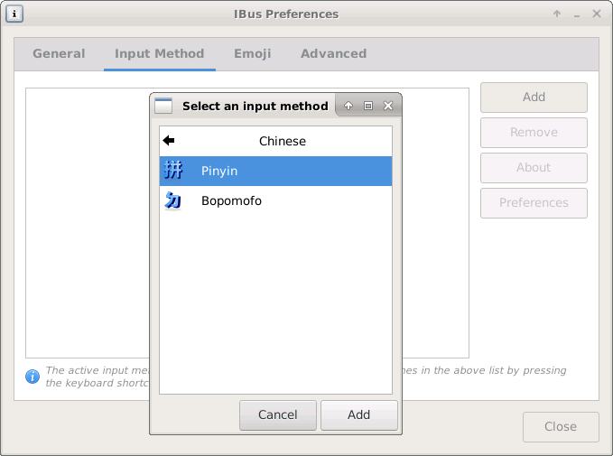

# Windows 系统登录虚拟机

## 命令行：使用 SSH 登录

### 安装 SSH 客户端

* Ubuntu 和 Debian：`sudo apt-get install ssh`
* CentOS, Fedora 和 RHEL：`sudo yum install ssh-clients`
* Arch Linux 和 Manjaro：`sudo pacman -S openssh`

### 登录

* 根据虚拟机登录 IP 地址和端口（例如，下图中地址为 `202.38.75.252`，端口为 `10003`），输入命令：

    ```shell
    ssh root@202.38.75.252 -p 10003
    ```

* 如果遇到 Warning，请输入 `yes`，然后输入之前设置的 root 密码，即可登录虚拟机

    {: .img-center }

## 图形界面：使用 VNC 登录

!!! info "注意"

    该登录方式只适用于名称中带有 `desktop` 的虚拟机镜像。

以 Windows 10 系统为例，[下载 RealVNC 客户端](https://www.realvnc.com/en/connect/download/viewer/windows/)并安装。安装好后在开始菜单中找到 RealVNC 的图标，如下图所示：

{: .img-center }

打开后的主界面如图所示，在地址栏输入 `vlab.ustc.edu.cn`，按回车连接：

{: .img-center }

这里提示要输入用户名和密码，输入学号（或工号）和网页平台的登录密码即可登录：

{: .img-center }

登录后即可看到桌面。初次登录时会提示初始化配置，选择 `Default config` 即可：

{: .img-center }

### 设置中文输入法

系统自带的输入法为 IBus，可以手动启用中文输入。在左上角找到 Applications → Settings → IBus Preferences 设置：

{: .img-center }

在 Input Method 选项卡点 Add，然后在 Chinese 里找到 Pinyin，再次点击右下角的 Add 即可：

{: .img-center }

添加成功后可以在右上角切换中文与英文输入法，也可以按 <kbd>Shift</kbd> 键在中文输入法中切换中英文输入。
