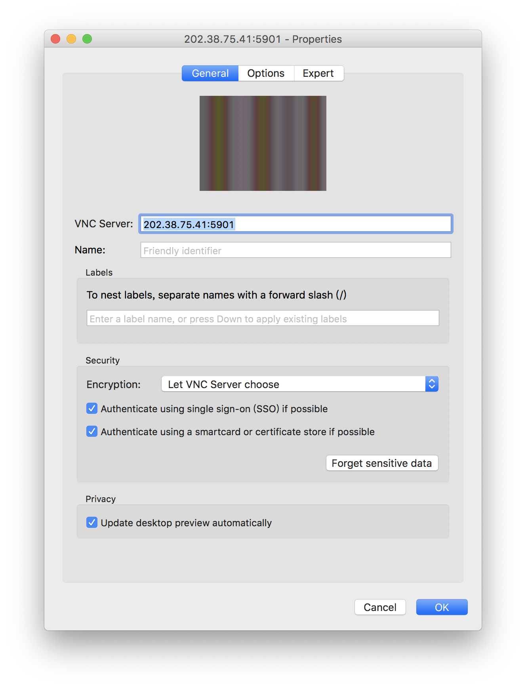
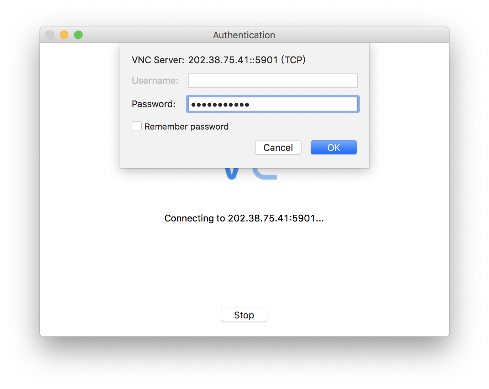

# 目录
{: .no_toc .text-delta }

1. TOC
{:toc}

## 登录

在登录界面，可以使用你的学号登录，或者使用统一身份认证登录。

请注意，如果你使用统一身份认证登录，请使用你的学号。使用 GID 会导致你在管理界面的登录被拒绝。

## 界面

登录后，你可以查看你账号下拥有的虚拟机。

下方四个按钮分别为：

- Start: 启动虚拟机（如果虚拟机处于关闭状态）
- Stop: 停止虚拟机运行
- Restart: 重启虚拟机（请注意在停止/重启前保存你的状态）
- Change Password: 改变密码。这会更改你的 UNIX 账户（默认为 ubuntu）的密码和 VNC 登录的密码。
  - 注意：太简单的密码可能会导致更改失败。

## 使用 VNC 登录虚拟机

下载 RealVNC 或 TigerVNC **客户端**（Client）。以下以 RealVNC 客户端为例。

选择 [文件] -> [新建连接]。在 VNC Server 这里输入 `IP 地址:5901` （注意冒号为半角的）。双击新建的连接登录。

输入你的密码，点击 OK 登录。

注意：请不要关闭 "VNC config" 窗口，否则复制粘贴功能可能会不正常。
